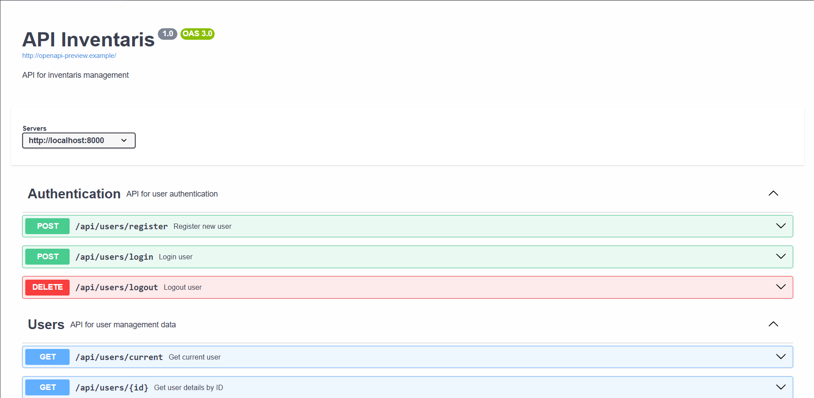

<p align="center">
  <a href="https://laravel.com" target="_blank">
    
  </a>
</p>

<p align="center">
    <a href="#"></a>
    <a href="#"></a>
    <a href="#"></a>
</p>

---

## 📦 Laravel Inventaris REST API

**Laravel Inventaris REST API** adalah backend berbasis Laravel untuk mengelola data inventaris barang secara efisien. Sistem ini menyediakan endpoint untuk melakukan operasi CRUD (Create, Read, Update, Delete) terhadap data seperti:

- Barang (Items)
- User (pengguna)
- Transaksi keluar/masuk

## 🚀 Fitur Utama

- Autentikasi User (Login, Register, Logout)
- Manajemen data barang
- Validasi input menggunakan Form Request
- Response API terstruktur menggunakan Laravel Resource
- Pengujian API Menggunakna Feature Test
- Dokumentasi OpenAPI

---

## 📘 Dokumentasi API

Berikut adalah tampilan dokumentasi API yang telah dibuat menggunakan OpenAPI:



---

## ⚙️ Instalasi

```bash
git clone https://github.com/username/inventaris-api.git
cd inventaris-api
composer install
cp .env.example .env
php artisan key:generate
php artisan migrate --seed
php artisan serve
